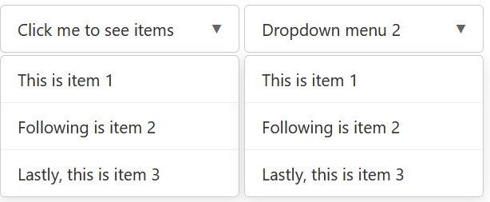

# wvictor14/basic-dropdown

Scoped public package 

Basic dropdown menu

# Install

```bash
npm i @victor2wy/basic-dropdown
```

# Usage

Write a drop down div manually in html 

<div class="dropdown">
    <div class="dropdown-title">Click me to see items</div>
    <div class="dropdown-items-list">
      <div class="dropdown-item">This is item 1</div>
      <div class="dropdown-item">Following is item 2</div>
      <div class="dropdown-item">Lastly, this is item 3</div>
    </div>
</div>

Then in js run

```js
import { initializeDropdowns } from "basic-dropdown";
initializeDropdowns();
```

